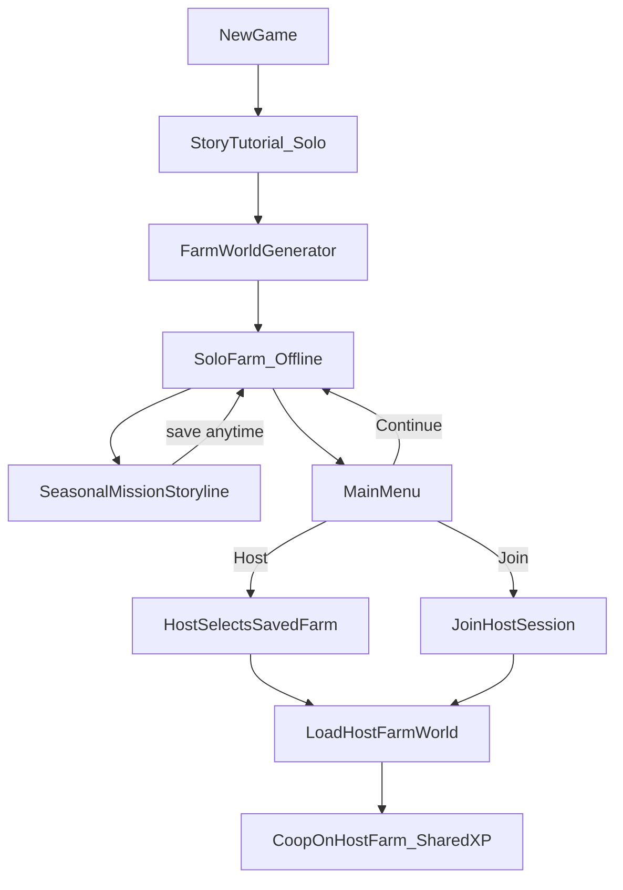
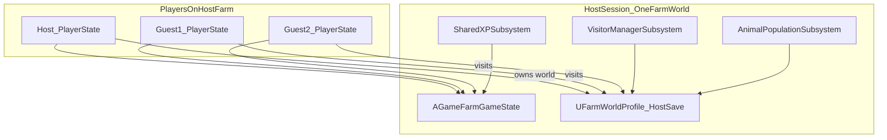
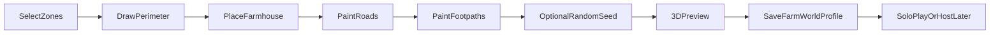
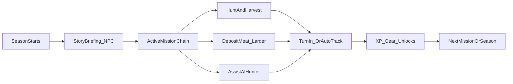

# Game Farm Manager — Systems & Task Roadmap

> UE 5.7 · C++ First Person (hybrid TP where needed) · Offline solo + optional multiplayer  
> Cartoon shader · Farm world generator · Seasonal missions · Hunting · AI visitors

## Current State

The UE **5.7 C++ First Person** project exists at `GameFarmManager/`:

- `GameFarmManager.uproject`, `Source/GameFarmManager/` with base classes (`GameFarmManagerCharacter`, `GameFarmManagerPlayerController`, `GameFarmManagerGameMode`, `GameFarmManagerCameraManager`)
- Template level `Lvl_FirstPerson` with `BP_FirstPersonGameMode`
- UE 5.7 template variants included: `Variant_Shooter` (weapons, projectiles, AI — useful reference for hunting), `Variant_Horror` (can ignore or strip later)
- Phase 0 partially complete: `.gitignore` added; git init/push and folder conventions still to do

**Locked-in decisions:**
- **C++ primary**, Blueprint-exposed APIs for designers
- **First Person default** — project created on FP template; hunting, stalking, and shooting feel primary
- **Third person where needed** — hybrid camera system for vehicles, management, and optional player toggle (see §2 Camera)
- **UE 5.7** on Windows
- **Listen server** (host + join) for early multiplayer; **Steam Online Subsystem** for sessions and future Steam release
- **Cartoon/toon shader** for low GPU requirements
- **Solo-first onboarding:** story tutorial → farm world generator → **full offline solo loop** (persistent farm + seasonal missions); multiplayer is optional
- **Offline persistence:** farm world, buildings, inventory, mission progress, and season state all save locally — no internet required
- **No preset farm sizes** — procedural/semi-procedural **world generator** (zones, perimeter, farmhouse, paths, roads, optional seed)
- **Multiplayer model:** each player builds their own farm solo; **host selects a saved farm** to host; **guests join the host's world** (shared session on one farm map)

---

## Player Flow (New Game → Solo Loop → Optional Multiplayer)



**Tutorial goals (keep it short, ~10–15 min):** introduce the fantasy of becoming a new farm manager — walk the land, meet a mentor NPC, place a temp marker, fire a practice shot (or bow draw), glimpse a herd, end with "now build your own farm."

**World generator goals:** player-authored farm layout, not Small/Medium/Large presets. Output is a saved `UFarmWorldProfile` used for offline solo and as a hostable world.

**Solo loop goals:** after building the farm, the player lives on it offline with a **mini storyline** — seasonal mission chains that drive hunting, gathering, and working with **AI hunter NPCs**. Progress persists on the farm save; multiplayer does not replace solo play.

---

## High-Level Architecture



**Key design principle:** Each player **creates and saves their own farm** offline (via the world generator). **Solo play is a complete experience** — farm state, storyline progress, and seasonal missions persist without multiplayer. In multiplayer, the **host loads one saved farm** and guests play in that world. **Shared XP** applies in MP sessions; **solo XP/unlocks** apply on the player's farm profile and carry into farms they host.

---

## System Catalog

### 1. Project Foundation
| System | Purpose |
|--------|---------|
| UE project scaffold | `.uproject`, C++ module, folder conventions |
| Module layout | Split into logical modules early to avoid monolith |
| Config & conventions | Naming, replication rules, logging |
| Cartoon rendering | Toon/cel-shader material master + post-process |
| Placeholder content kit | Prototype meshes, anim notifies, temp VFX/SFX |

**Suggested module split:**
- `GameFarmManager` — game module entry
- `GameFarmCore` — data assets, enums, interfaces
- `GameFarmNetworking` — sessions, replication helpers
- `GameFarmFarm` — world generator, farm plots, buildings, paths
- `GameFarmWildlife` — animals, herds, population sim
- `GameFarmHunting` — weapons, ballistics, harvest
- `GameFarmGear` — vehicles, tents, inventory
- `GameFarmVisitors` — AI guests, resort economy
- `GameFarmMissions` — solo campaign, mission chains, AI hunters (or keep in main module initially)

Start with one module; extract when compile times hurt.

---

### 2. Core Game Framework
| System | Key classes / assets |
|--------|---------------------|
| Game flow | `AGameFarmGameMode`, `AGameFarmGameState`, `AGameFarmPlayerState`, `AGameFarmPlayerController`, `AGameFarmCharacter` — evolve from existing `GameFarmManager*` classes |
| Camera | `UGameFarmCameraManager` + `UCameraMode` stack: **FirstPerson** (default), **ThirdPerson** (spring arm), **Vehicle**, **Photo/Inspect** |
| Subsystems | `UGameInstance` subsystems for save, sessions, audio |
| Data-driven config | `UDataAsset` / `UPrimaryDataAsset` for species, weapons, zone biomes, visitor types, tutorial beats |
| Save/Load | Per-player farm library (`UFarmWorldProfile`: world + buildings + mission/season state); offline-first; tents as in-world checkpoints; tutorial flag on profile |
| Input | Enhanced Input mapping contexts (on foot FP, on foot TP, in vehicle, UI); camera toggle action |

#### Hybrid camera (First Person + Third Person)

**Default: First Person** for on-foot gameplay — hunting, missions, farmhouse interact, caller placement.

**Switch to Third Person when:**
| Context | Camera | Why |
|---------|--------|-----|
| On-foot hunting (default) | First Person | Aim, stalk, weapon feel |
| 4x4 / vehicle | Third Person chase cam | See vehicle on terrain; already standard for driving |
| World generator / building placement | Orbit or TP overview | See perimeter, roads, farmhouse placement on land |
| Walking with AI hunter / visitors (optional) | Third Person toggle | See character + NPCs; management/social moments |
| Photo mode / trophy pose (stretch) | Third Person | Cosmetic |

**Implementation approach:**
- Extend existing `GameFarmManagerCameraManager` with mode enum + blend
- FP: camera on mesh socket (template default)
- TP: add `USpringArmComponent` + secondary camera; enable only in TP/Vehicle modes (no arm tick cost in FP)
- Player toggle: `IA_ToggleCamera` (optional bind; default stays FP)
- Vehicles use separate pawn with own camera; return to FP on exit
- Replicate active camera mode on `PlayerState` for MP consistency

**Reuse from template:** `Variant_Shooter` weapon/projectile code is a reference for rifle/hitscan work — not the final hunting model, but saves bootstrapping.

---

### 3. Multiplayer & Steam
| System | Details |
|--------|---------|
| Listen server | Host runs authoritative simulation; clients predict movement locally |
| Replication | Server-authoritative: damage, harvests, XP, economy, visitor state |
| Sessions | Create / find / join via Online Subsystem (Null OSS in dev, Steam OSS later) |
| Per-player farm library | Each account/profile stores multiple `UFarmWorldProfile` saves from the generator |
| Host farm selection | Host picks a saved farm before session create; server loads that profile into the game map |
| Guest join | Guests load into host's farm world (not their own solo save) |
| Shared XP | `AGameFarmGameState` holds session XP pool; hunt/visitor events grant XP server-side |
| Anti-cheat basics | Server validates shots, harvests, purchases — no client-trusted rewards |

**Steam path (later phase):** Enable Steam Online Subsystem plugin, App ID, `DefaultEngine.ini` OSS config, Steam lobby invites, build depot. Listen server works on Steam; dedicated servers can be added post-launch if needed.

---

### 4. Story Tutorial (Solo Onboarding)
| System | Details |
|--------|---------|
| Tutorial game mode | Separate `ATutorialGameMode` / tutorial sub-level; no multiplayer |
| Narrative beats | `UTutorialBeatData` sequence: mentor dialogue, guided movement, interact prompts |
| Story framing | Player is a new farm manager arriving on a training plot; mentor NPC (Blueprint dialog) |
| Mechanics teased | Walk, look, interact, optional practice shot, spot animals, basic management UI peek |
| Length target | ~10–15 minutes; skippable on repeat via profile flag |
| Completion gate | `bTutorialComplete` on save profile → unlocks **Farm World Generator** |
| Sequencer / dialog | Level Sequences for intro/outro; widget-based subtitles; VO optional later |

**Tutorial beat example (5 steps):**
1. Arrive — mentor welcomes you, explain game farm fantasy
2. Walk the boundary — follow spline path around training plot
3. Spot wildlife — trigger herd spawn in distance, use binoculars prompt
4. Practice tool — safe shooting range OR bow draw (no kill required)
5. Handoff — mentor sends you to "claim your own land" → World Generator

---

### 5. Farm World Generator
Replaces preset Small/Medium/Large. Player authors their farm on a **regional map**, then the generator bakes a playable farm world from their choices.

| System | Details |
|--------|---------|
| Regional map | Overhead map of claimable **zones** (biome regions: savanna, bushveld, wetland, etc.) |
| Zone selection | Player picks one or more adjacent zones; each zone has biome tags, animal tables, visitor appeal |
| Farm perimeter | Player draws/edits **outline** on map (polygon tool); defines legal build/hunt boundary |
| Farmhouse placement | Place primary lodge/house inside perimeter; validates slope, water distance, road access |
| Roads | Wider splines; connect farmhouse to zone entry / main gate; vehicle-navigable |
| Footpaths | Narrower splines; viewing routes, tent trails, visitor walks |
| Random seed | Optional seed input → procedural scatter (trees, rocks, water features) within rules |
| Preview | Real-time 3D preview of terrain + paths before confirm |
| Output | `UFarmWorldProfile` serialized: zones, perimeter poly, spline paths, seed, farmhouse transform |
| Bake step | Server/host runs landscape mesh + foliage + splines spawn from profile (PCG or custom baker) |



**Generator tech options (recommend hybrid):**
- **Landscape** — UE Landscape with heightmap stamps per biome zone
- **PCG** — scatter vegetation/rocks by biome + seed
- **Splines** — `USplineComponent` for roads/paths → mesh deformation + nav generation
- **Perimeter** — closed spline → `AFarmBoundaryVolume` + minimap mask

**Constraints to enforce:**
- Min/max area from zone count (not named tiers — derived from selected zones)
- Farmhouse must be inside perimeter
- Roads must connect farmhouse to at least one gate
- Paths cannot exit perimeter without a gate segment

---

### 6. Farm Gameplay & Buildings
| System | Details |
|--------|---------|
| Farm instance | Runtime spawned from `UFarmWorldProfile` on load |
| Building placement | Server-validated ghost preview inside perimeter; replicate `AFarmBuilding` |
| Terrain & biomes | From generator zones; drives animal spawn tables and visitor appeal |
| Resort facilities | Lodges, viewing towers, shops — tie into visitor AI and revenue |
| Farm library | Multiple saved farms per player; each holds full offline state; host picks one for MP |

---

### 7. Wildlife & Herd Management
| System | Details |
|--------|---------|
| Species definitions | `UAnimalSpeciesData`: mesh ref, behavior profile, trophy value, herd rules |
| Population sim | Server ticks spawn/despawn caps, age, health, stress from hunting pressure |
| Herd AI | Leader + followers; grazing, flee, call-response; EQS for cover/water |
| Animal states | Idle, Graze, Alert, Flee, Dead; replicated state machine |
| Management tools | Feeders, salt licks, enclosures — affect population and visitor rating |
| Hunting integration | Animals register with `AnimalPopulationSubsystem`; kills update herd stats |

---

### 8. Hunting & Weapons
| System | Details |
|--------|---------|
| Weapon base | `AWeaponBase` → `ARifle`, `APistol`, `ABow` (different fire modes) |
| Ballistics | Hitscan (rifle/pistol) vs projectile (bow); penetration optional later |
| Damage model | Zone-based damage (vital organs); species-specific thresholds |
| Callers / decoys | Placeable actors that attract species within radius |
| Tracking | Footprints, blood trails (decal + EQS query), sound detection |
| Harvest | Server spawns trophy / meat pickup; inventory update; meat counts toward gather missions |

---

### 9. Solo Campaign & Missions (Offline Storyline)
The **main solo gameplay loop** after farm creation. Missions give structure to hunting and management; progress saves with the farm — fully playable offline.

| System | Details |
|--------|---------|
| Season framework | Farm runs in **seasons** (e.g. Spring hunt prep, Summer cull, Autumn harvest); new mission chains unlock per season |
| Mission chains | `UMissionChainData` — ordered missions with story dialog beats between them |
| Mission definition | `UMissionData`: type, targets, rewards, fail/timeout rules, prerequisite missions |
| Mission manager | `UMissionSubsystem` on solo `GameMode`; tracks active, completed, failed missions per farm save |
| Mission journal UI | Active objectives, season timer, story log, turn-in prompts at farmhouse |

**Core mission types (v1):**

| Type | Example | Completion rule |
|------|---------|-----------------|
| `GatherResource` | "Stock 50 kg meat for the season" | Meat deposited at farmhouse cold store / larder interactable |
| `HuntSpecies` | "Harvest 3 kudu bulls" | Server/local authority counts qualifying kills + harvests on this farm |
| `AssistAIHunt` | "Help tracker Johan take 1 warthog" | AI hunter NPC tags animal; player must assist (spot, flush, call, or confirm kill) |
| `DeliverItem` | (stretch) Bring gear to NPC | Inventory check at NPC |
| `TalkToNPC` | Season briefing at farmhouse | Dialog sequence complete |



**AI hunter companions (`AAIHunterNPC`):**
- Spawn at farmhouse or camp at mission start
- Behavior tree: follow player → move to hunting zone → wait for player flush/call → take shot or support player shot
- `AssistAIHunt` missions require **both** player contribution (e.g. spotted animal, used caller, damaged target) and AI success condition
- Named NPCs (Johan, Maria, etc.) for story continuity across seasons
- Optional: hire additional AI hunters later via progression

**Storyline layering:**
- **Tutorial** = one-off onboarding (separate level)
- **Solo campaign** = ongoing mini-story on the player's farm (mentor letters, seasonal radio, NPC visits)
- Mission dialog via `UMissionDialogData` + widget subtitles; Sequencer for key season intros

**Offline persistence (`UFarmWorldProfile` extension):**
```
FMissionSaveState:
  currentSeasonId
  completedMissionIds[]
  activeMissionIds[] + per-mission counters (meatDeposited, killsBySpecies, assistFlags)
  npcRelationshipFlags (optional)
  soloXP / unlock tier
```

**Multiplayer interaction:**
- Mission progress is **solo-only** on the farm save; hosting does not reset it
- Optional later: co-op missions on host farm (out of v1 scope)
- Guest players do not advance host's mission chain

---

### 10. Gear, Vehicles & Save Points
| System | Details |
|--------|---------|
| Loadout | Pre-hunt gear selection; replicated equipped items |
| Inventory | Server-authoritative item list on `PlayerState` |
| 4x4 vehicle | `AWheeledVehiclePawn` or custom movement; enter/exit, rack storage |
| Tents | Placeable save point; interact to save farm snapshot + player state |
| Callers, optics | Attachments as data-driven modifiers on weapons |

---

### 11. AI Visitors & Resort Economy
| System | Details |
|--------|---------|
| Visitor spawning | Timed waves based on resort rating and facilities |
| Visitor AI | Behavior tree: arrive → activity (viewing, shop, lodge) → leave |
| Needs / satisfaction | Safety, sightings, amenities → rating → revenue + shared XP |
| Economy | Currency on `GameState` or per-farm ledger; spend on upgrades |
| Schedule | Day/night cycle affects visitor types and animal activity |

---

### 12. Progression & Meta
| System | Details |
|--------|---------|
| Solo progression | XP and unlocks on `UFarmWorldProfile` from missions, hunts, season completion — works offline |
| Shared XP (MP) | Session pool on `GameState` when hosting/joining; separate from solo profile XP |
| Per-player stats | Hunt log, trophies, mission history |
| Unlock tables | Data assets gating weapons, gear, zones by solo XP tier |
| Farm upgrades | Expand zones, extend perimeter — mission rewards or XP gates |

---

### 13. UI / UX
| Screen | Purpose |
|--------|---------|
| Main menu | New game (tutorial), **continue offline farm**, host/join MP, settings |
| Tutorial HUD | Objective tracker, dialog subtitles, minimal prompts |
| World generator | Zone map, perimeter draw tool, farmhouse place, road/path paint, seed field, preview |
| **Mission journal** | Active season, mission list, objectives (meat count, hunt tally, assist status), story log |
| Host lobby | Pick saved farm, session settings, ready up |
| Join flow | Browse / direct join host session |
| Management HUD | Herd counts, visitor rating, economy, **season countdown** |
| Hunting HUD | Crosshair, wind, noise meter, caller cooldown, **mission markers** |
| Inventory / shop | Gear and building purchases |
| Map | Farm perimeter, roads, paths, tent locations, visitor routes, **AI hunter / objective pins** |

Use Common UI or UMG; bind to replicated `PlayerState` / `GameState`.

---

### 14. Audio
| Layer | Notes |
|-------|-------|
| Ambient | Per-biome loops |
| Animals | Calls, footsteps, alert barks |
| Weapons | Fire, reload, bow creak |
| Visitors | Chatter, satisfaction cues |
| Meta | UI clicks, XP gain stinger |

---

### 15. Art Pipeline (process — no modeling from code)
You handle models/rigging externally; the project provides the **pipeline**:

1. **Art direction doc** — poly budget, texture size (512–1K), flat colors + hand-painted normals
2. **Cartoon shader master** — cel shading (custom HLSL or Material Plugin), outline pass (post-process or inverted hull), single directional light
3. **Import settings** — FBX scale, skeleton retarget to UE mannequin or custom `UAnimalSkeleton`
4. **Placeholder phase** — UE mannequin, basic shapes, Quixel/Stylized packs until custom assets ready
5. **Per-asset checklist** — mesh LODs, collision, sockets (weapon attach, vehicle seat), anim blueprint hooks
6. **Rigging handoff** — naming convention for bones (`spine_01`, `head`, `antler_L`), export T-pose, root bone at origin

---

## Phased Implementation Tasks

### Phase 0 — Foundation (Week 1–2)
- [x] Create UE 5.7 C++ First Person project `GameFarmManager`
- [x] Add `.gitignore` for UE
- [x] Initialize git + push to GitHub (`DooMShortS/GameFarmManager`)
- [x] Folder structure: `Content/GameFarm/{Core,Tutorial,Farm,Missions,Wildlife,Hunting,Gear,Visitors,UI,Audio,Materials}`
- [x] Evolve template classes → `GameFarm*` framework (extend existing `GameFarmManagerCharacter`, etc.)
- [x] **Hybrid camera stub:** FP default + spring-arm TP on toggle; extend `GameFarmManagerCameraManager`
- [ ] Reuse `Variant_Shooter` as rifle/projectile reference until dedicated hunting weapons exist
- [ ] Enhanced Input: move, look, interact, optional `IA_ToggleCamera` (move/look/toggle wired in C++; `IA_ToggleCamera` asset still needs creating in editor; interact not started)
- [ ] Cartoon material master + test level lighting
- [x] Profile save subsystem (`UGameFarmSaveGame`: tutorial flag, farm library index)
- [ ] `ASoloGameMode` — offline farm load, auto-save on interval + at tents/farmhouse (interval autosave + profile load/save done; farm world load blocked on Phase 2, tent/farmhouse-triggered save blocked on Phase 5)

### Phase 1 — Story Tutorial (Week 2–4)
- [ ] `ATutorialGameMode` + tutorial sub-level (C++ class done; tutorial sub-level, training plot, mentor NPC placeholder need the editor)
- [ ] `UTutorialSubsystem` — beat index, objective UI, completion flag (beat index + completion done in C++; objective UI widget not started)
- [ ] `UTutorialBeatData` assets for 5 core beats (dialog text, trigger volumes, sequence refs) (C++ data asset class done; no actual beat asset instances created yet — editor work)
- [ ] Guided interactions: move, interact, binoculars prompt, practice range
- [x] On complete: set `bTutorialComplete`, travel to World Generator map
- [x] Skip tutorial option for dev / returning players with flag set

### Phase 2 — Farm World Generator (Week 4–8)
- [ ] `UFarmWorldProfile` struct: zones, perimeter points, splines, seed, farmhouse transform
- [ ] Regional map UI: zone selection (click adjacent biome cells)
- [ ] Perimeter editor: polygon draw on map → validate area bounds from zone count
- [ ] Farmhouse placer: raycast on preview terrain, snap rules
- [ ] Road / footpath spline tools (width, material type, navmesh influence)
- [ ] Random seed field → PCG or scatter pass for trees/rocks
- [ ] 3D preview mode — **orbit / third-person overview camera** for WYSIWYG layout
- [ ] **Bake pipeline:** profile → landscape + boundary volume + splines + foliage
- [ ] Save farm to player library; load for solo offline play
- [ ] Solo game mode: load profile, spawn player at farmhouse, **restore mission/season state**

### Phase 3 — Wildlife & Hunting Core (Week 8–12)
- [ ] `UAnimalSpeciesData`, `AAnimalBase` character
- [ ] Herd component: leader, members, shared flee target
- [ ] Behavior tree + EQS: graze points, flee from player noise
- [ ] `UAnimalPopulationSubsystem`: spawn caps, despawn distant animals
- [ ] `AWeaponBase` hierarchy; rifle hitscan v1
- [ ] Damage component on animals; death → harvest actor (meat resource)
- [ ] Meat inventory item + weight tracking for gather missions

### Phase 4 — Solo Campaign & Missions (Week 12–15)
- [ ] `UMissionData`, `UMissionChainData`, `USeasonData` primary data assets
- [ ] `UMissionSubsystem` — activate chain, track counters, complete/fail, save to `UFarmWorldProfile`
- [ ] Mission types v1: `GatherResource` (meat to larder), `HuntSpecies`, `AssistAIHunt`
- [ ] `AAIHunterNPC` + behavior tree: follow, stalk, shoot/support, mission credit on assist
- [ ] Farmhouse **larder** interactable — deposit meat, update gather mission counter
- [ ] Mission journal UI + objective tracker HUD
- [ ] Season 1 mission chain (5–8 missions) with dialog beats — proof of storyline loop
- [ ] Auto-save mission progress on complete, deposit, kill, quit

### Phase 5 — Farm Gameplay Layer (Week 15–17)
- [ ] Building placement inside perimeter: ghost actor, overlap validation
- [ ] Management HUD: perimeter map overlay, season/mission summary
- [ ] Gate / entry points from road splines for future visitor spawn
- [ ] Basic management interactables: feeder, salt lick

### Phase 6 — Multiplayer Shell (Week 17–19)
- [ ] Listen server: host/join from main menu (Null OSS)
- [ ] Host flow: **select saved farm** from library → create session → load that `UFarmWorldProfile`
- [ ] Guest flow: join session → load into host's baked farm (replicate host world seed/profile ID)
- [ ] `AGameFarmGameState`: shared XP, session farm ID, player roster
- [ ] Replicate `PlayerState` (name, ready flag, role host/guest)
- [ ] Host lobby UI: farm picker, ready up, start game
- [ ] **Note:** MP uses same baked farm; solo mission state on host save is not advanced by guests

### Phase 7 — Hunting Expansion (Week 19–21)
- [ ] Pistol, bow projectile; callers; noise system
- [ ] Hunting HUD polish; server validates kills in MP
- [ ] Mission kill counters work in solo; MP XP via `GameState`

### Phase 8 — Gear & Traversal (Week 21–23)
- [ ] Inventory component on `PlayerState` (replicated array)
- [ ] Loadout screen pre-deploy
- [ ] Tent placeable: interact → trigger save
- [ ] 4x4: Chaos Vehicle or simplified wheeled pawn; **third-person chase camera**; driver/passenger seats
- [ ] Gear storage on vehicle rack

### Phase 9 — Visitors & Economy (Week 23–26)
- [ ] `UVisitorTypeData`, `AVisitorCharacter` with behavior tree
- [ ] Spawn manager: visitor quota from resort rating
- [ ] Activities: path to viewing stand, watch animals, visit shop
- [ ] Satisfaction score → currency + shared XP
- [ ] Shop UI: buy buildings, gear, farm upgrades
- [ ] Day/night cycle subsystem (optional but high value)

### Phase 10 — Progression & Polish (Week 26–29)
- [ ] XP unlock tables (data assets)
- [ ] Per-player trophy room / stats
- [ ] Map UI with farm overlays
- [ ] Audio pass; mix categories
- [ ] Performance: HLOD, animal LOD, net relevancy per farm zone
- [ ] Playtest balance: spawn rates, weapon damage, XP curves

### Phase 11 — Steam Release Prep (Week 29+)
- [ ] Steamworks SDK / OnlineSubsystemSteam plugin
- [ ] Steam App ID (dev + ship), session invites, overlay
- [ ] Packaging, depots, default server browser settings
- [ ] Crash reporting, analytics hooks
- [ ] Store page assets (out of code scope)

---

## Coding Tasks (Agent Handoff Batches)

1. **Scaffold UE project** — profile save, folder structure, evolve base classes
2. **Tutorial shell** — `TutorialGameMode`, beat subsystem, 1 guided beat end-to-end
3. **World profile struct** — `UFarmWorldProfile` serialize/deserialize
4. **Zone map UI** — select zones, draw perimeter polygon
5. **Spline tools** — road/footpath placement + preview bake
6. **Solo load** — bake profile into playable farm, spawn at farmhouse, offline save
7. **Mission subsystem** — one `HuntSpecies` mission end-to-end with journal UI
8. **`AAIHunterNPC`** — one `AssistAIHunt` mission with follow + kill credit
9. **Meat gather loop** — harvest → inventory → larder deposit → mission complete
10. **Host farm picker + session** — load saved profile on host, guests join

---

## Recommended File / Class Seeds

```
Source/GameFarmManager/
  Core/
    GameFarmGameMode.h/.cpp          # evolve from GameFarmManagerGameMode
    GameFarmCameraManager.h/.cpp     # extend with FP/TP/Vehicle modes
    GameFarmCharacter.h/.cpp
    GameFarmPlayerState.h/.cpp
    GameFarmPlayerController.h/.cpp
    GameFarmSaveGame.h
  Tutorial/
    TutorialGameMode.h/.cpp
    TutorialSubsystem.h/.cpp
    TutorialBeatData.h
  Farm/
    FarmWorldProfile.h
    FarmWorldGeneratorSubsystem.h/.cpp
    FarmWorldBaker.h/.cpp
    FarmBoundaryVolume.h/.cpp
    FarmBuilding.h/.cpp
    FarmPlacementComponent.h/.cpp
    ZoneData.h
  Missions/
    MissionSubsystem.h/.cpp
    MissionData.h
    MissionChainData.h
    SeasonData.h
    AIHunterNPC.h/.cpp
    LarderBuilding.h/.cpp
  Wildlife/
    AnimalBase.h/.cpp
    HerdComponent.h/.cpp
    AnimalPopulationSubsystem.h/.cpp
  Hunting/
    WeaponBase.h/.cpp
    RifleWeapon.h/.cpp
    BowWeapon.h/.cpp
    CallerActor.h/.cpp
  Networking/
    GameFarmSessionSubsystem.h/.cpp
  Data/
    AnimalSpeciesData.h
    WeaponData.h
```

---

## Risks & Mitigations

| Risk | Mitigation |
|------|------------|
| Scope creep | Vertical slice: tutorial → mini generator (1 zone, perimeter, house) → solo hunt → host that farm |
| World gen complexity | Phase generator tools incrementally; start with zone + perimeter + house before roads/PCG |
| Listen server cheating | Server-authoritative rewards; validate line traces server-side |
| Animal AI cost | Per-farm relevancy; despawn beyond perimeter; tick herds at lower rate |
| Art bottleneck | Placeholder kit + strict shader so temp assets look cohesive |
| Steam later | Abstract Online Subsystem from day 1; no hardcoded Null OSS calls in UI |
| Solo mission scope | Season 1 chain only in v1; one AI hunter archetype; 3 mission types |
| Mission / MP confusion | Mission state solo-only on farm save; document that guests don't progress host story |

---

## Suggested First Milestone (Vertical Slice)

**"Tutorial → build farm → complete one season offline"**

1. Complete 5-beat story tutorial (~10 min)
2. World generator v1: pick 1 zone, draw perimeter, place farmhouse
3. Bake and play **offline** on your farm — farm persists on quit/relaunch
4. Season 1 opens with briefing dialog at farmhouse
5. Complete 3 missions: deposit meat quota, hunt 2 of species X, assist AI hunter on 1 kill
6. 1 deer species with simple herd AI; 1 rifle; meat harvest + larder deposit
7. *(Stretch)* Host that same save; 1 guest joins for a hunt — shared session XP only

This proves offline farm ownership, storyline missions, and hunting loop before visitors/vehicles/full MP polish.
